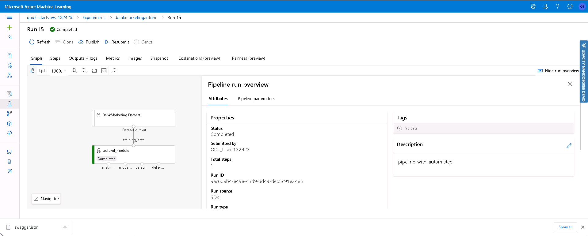
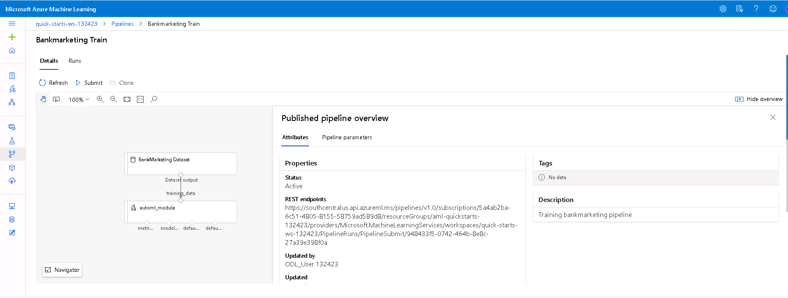

# Operationalizing Machine Learning

This project leverages the familiar bank marketing dataset and Azure AutoML to train machine learning models. We also use two methods to operationalize machine learning. One is directly through AutoML while the second is through a pipeline. The model with the most accuracy is then deployed as an endpoint as an Azure Container Instance. Through this Azure Container Instance, an authenticated REST endpoint is used to access the model with an API documented via Swagger. 

## Architectural Diagram

From this diagram, we see that our initial input is the Bank Marketing dataset, which gets fed into both a Jupyter Notebook for the pipeline and directly into AutoML as a registered dataset. We then directly train, register, and deploy a model manually through AutoML and then automate the process using the Python SDK in the Jupyter notebook. Through these two methods, we operationalize machine learning. The pipeline lets us automate the AutoML runs on a compute cluster and outputs both a best model and a pipeline endpoint. The best model then gets deployed as an Azure Container Instance endpoint. From our endpoint, we get API Documentation via Swagger, logging via Application Insights, and performance metrics via Apache benchmark. At the end, users interact with our model through either the pipeline endpoint, or the Azure Container instance. They also interact with the API, logs, and performance metrics. 

## Key Steps
*TODO*: Write a short discription of the key steps. Remeber to include all the screenshots required to demonstrate key steps.

1. Make sure our dataset is registered in ML Studio. 

2. Run AutoML experiment on our compute clusters (classification with best model measured by accuracy metric). 

3. Once the experiment completes, we can see the best-performing model. 

4. We now deploy this best model as an endpoint with Azure Container Instance (ACI) 

5. Enable logging (Application Insights) and view logs. 

6. Now that we've enabled logging, we can use Swagger to show the API. 

7. Using this API, we can use this endpoint. 

8. As an extra step, we use Apache to benchmark our endpoint. 

9. We then use a Jupyter notebook to train and deploy an AutoML model as a pipeline. 

10. Here, we see the pipeline running. Note that the Bank Marketing dataset is present and registered before being passed into the AutoML module. 

11. We then wait for the pipeline to complete before deploying it as an endpoint. We can also run the pipeline through the endpoint much like with our previous AutoML model. 

## Screen Recording
https://youtu.be/8isEdT9vKdo

## Improvements
In order to improve this project in the future, we can employ deep learning, ensure a balanced dataset before training, and evaluate the best model by different metrics or even more than one metric.
