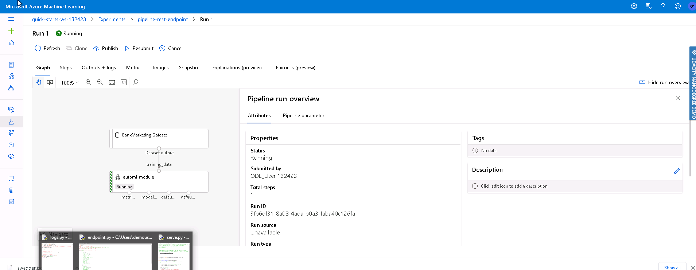

*NOTE:* This file is a template that you can use to create the README for your project. The *TODO* comments below will highlight the information you should be sure to include.

# Operationalizing Machine Learning

This project leverages the familiar bank marketing dataset and Azure AutoML to train machine learning models. The model with the most accuracy is then deployed as an endpoint as an Azure Container Instance. Through this Azure Container Instance, an authenticated REST endpoint is used to access the model with an API documented via Swagger. 

## Architectural Diagram
*TODO*: Provide an architectual diagram of the project and give an introduction of each step. An architectural diagram is an image that helps visualize the flow of operations from start to finish. In this case, it has to be related to the completed project, with its various stages that are critical to the overall flow. For example, one stage for managing models could be "using Automated ML to determine the best model". 

## Key Steps
*TODO*: Write a short discription of the key steps. Remeber to include all the screenshots required to demonstrate key steps.

1. Make sure our dataset is registered in ML Studio. 

2. Run AutoML experiment on our compute clusters (classification with best model measured by accuracy metric). 

3. Once the experiment completes, we can see the best-performing model. 

4. We now deploy this best model as an endpoint with Azure Container Instance (ACI) ![Deployed Model] (./screenshots/best_model_deployed.PNG)

5. Enable logging (Application Insights) and view logs. ![Logging and insights] (./screenshots/insights_and_logs.PNG)

6. Now that we've enabled logging, we can use Swagger to show the API. 

7. Using this API, we can use this endpoint. 

8. As an extra step, we use Apache to benchmark our endpoint. 

9. We then use a Jupyter notebook to train and deploy an AutoML model as a pipeline. 

10. Here, we see the pipeline running. Note that the Bank Marketing dataset is present and registered before being passed into the AutoML module. 

11. We then wait for the pipeline to complete before deploying it as an endpoint. We can also run the pipeline through the endpoint much like with our previous AutoML model. 

## Screen Recording
*TODO* Provide a link to a screen recording of the project in action. Remember that the screencast should demonstrate:

http://youtube.com/watch?v=3mpS5lkeZNE/

## Standout Suggestions
*TODO (Optional):* This is where you can provide information about any standout suggestions that you have attempted.
